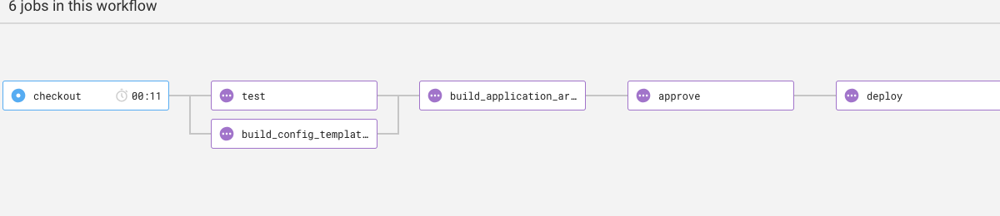

# Fluffy Django CMS
This repository contains minimalistic deployment scripts for Django CMS. Its designed to be deployed to both local kubernetes cluster - minikube or any cloud-based kubernetes cluster. This deployment setup includes the following.

- Django cms source code
- Minikube deployment scripts
- GKE deployement setup
- Circleci deployement pipeline
- kubernetes configuration objects

## Usage
These deployment scripts are designed to be deployed to both local and cloud-based clusters. We have isolated the scripts to provide an easier way to deploying each of these clusters with ease. We make use of the following tools, ensure you have then installed before you proceed.

- [Kubernetes CLI](https://kubernetes.io/docs/tasks/tools/install-kubectl/)
- [Minikube](https://github.com/kubernetes/minikube)
- [Docker](https://www.docker.com/get-started)
- [Virtualbox](https://www.virtualbox.org/)
- [Reactiveops K8s scripts](https://github.com/reactiveops/rok8s-scripts)
- Gloud SDK
>> If you are using MacOsx you can install the above binaries with brew
```bash
$ brew cask install virtualbox
$ brew cask install minikube
$ brew cask install google-cloud-sdk
$ brew install kubernetes-cli
```
#### Local Kubernetes Cluster - Minikube

**Starting K8s Cluster** - Before running any scripts you need to ensure that your local k8s cluster is up and running. In this example I will be using minikube. Docker for mac comes bundled with kubernetes cluster. You can enable this under preference setting, kubernetes tab, therefore you might need to skip this step.

```bash
# start k8s cluster
$ minikube start --vm-driver=virtualbox

# confirm status

$ minikube status
```

Once minikube is done provisioning the cluster it will set kubectl context for us.

**Deploying to the cluster** - Once the cluster is up and running, you can run the minikube_deploy script with will automate the configuration, docker builds and deployment to the local cluster.
>> Note: You need to authenticate to your container registry before you run the script.

```bash
$ chmod +x bin/minikube_deploy
$ bin/minikube_deploy main
```
The above command uses rok8s-scripts commands under the hood to build, push and deploy to minikube. If you are not using minikube you might need to comment out `minikube-deploy` command and use `k8s-deploy-and-verify` instead. You can find detailed documentation on rok8s-scripts here.

### Cloud-Based Kubernetes Cluster - GKE
For cloud-based deployment, we have set up and build a deployment pipeline that will automate this process. The circleci configuration pipeline can be found under `.circleci` folder. For the local environment we have been using nginx ingress, for GKE I would recommend using GCE ingress unless you have a specific reason not to. You might need to change your ingress template file to look as below.
```yaml
apiVersion: extensions/v1beta1
kind: Ingress
metadata:
  name: {{ PROJECT_NAME }}
  namespace: {{ NAMESPACE }}
  labels:
    app: {{ PROJECT_NAME }}
  annotations:
    kubernetes.io/ingress.global-static-ip-name: <name of the global static ip>
spec:
  backend:
    serviceName: {{ PROJECT_NAME }}
    servicePort: http

```

Create a global static IP.
```bash
$ gcloud compute addresses create <name of the global static ip> --global
```

**Starting a cluster**
Once you have made this changes, you need to create a cluster. You can follow this [setup guide](https://zero-to-jupyterhub.readthedocs.io/en/v0.4-doc/create-k8s-cluster.html#google-cloud) to have your cluster up and running.

**Authenticating with the cluster**
To access the GKE cluster you need to set up access via service account. This service account will provide you access to the cluster and also container registry if you prefer using GCR over docker hub. Editor role for the project should be enough.

>> For security reasons you might need to restrict this access further to only Storage Admin and Kubernetes admin.

**Deploy from local machine**
You can deploy from your local machine to cluster you have created. Run the command below to connect to the cluster
```
$ COMPUTE_ZONE=<zone your cluster is created>
$ CLUSTER_NAME=<name of your cluster>
$ GOOGLE_PROJECT_NAME=< google project hosting your cluster>
$ gcloud container clusters get-credentials $CLUSTER_NAME --zone $COMPUTE_ZONE --project $GOOGLE_PROJECT
```

In `minikube_deploy` script replace `minikube-deploy` with `k8s-deploy-and-verify`. this will deploy to cluster on the current context and verify if the deployment was successful.

**Deployment via Pipeline**
We have configured a sample circleci pipeline that will build image and deploy to kubernetes. This process is done via the following jobs.



- **checkout**: checks out our code
- **test**: runs unit tests, (if any)
- **build_config_templates**: Builds k8s configuration templates
- **build_application_artifacts**: Builds docker image stores it to container registry
- **approve**: stalls pipeline for approval
- **deploy**: deploys to K8s cluster

For the pipeline to run successfully you need the following environment variables set
- **PROJECT_ID:** Googe project id/name
- **COMPUTE_ZONE:** Compute Zone the cluster is running on
- **CLUSTER_NAME:** Name of the GKE cluster
- **GCLOUD_SERVICE_KEY:** Service account with Storage Admin and GKE admin role access - ( should be in base64 format )

>> Note: build_application_artifacts, approve and deploy jobs will only run on the master branch to prevent deployments being triggered per each branch or commit.
